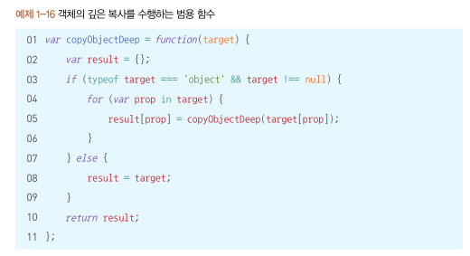

# Step2

## 자바스크립트의 역사
by 준일
[:link:](../core-javascript/자바스크립트의%20역사#Ref.%20황준일님%20디스코드%20준피셜...)
 
## 값
 
### by 정웅 
- 원시 값은 모두 typeof 로 확인 할 수 있다.
- null 은 원시값인데 typeof 의 object

- 문자열과 배열의 차이는 문자열은 Immutable 배열은 Mutable이다. 
따라서 str[0] 의 접근 방법은 바르지 못하다. 
str.charAt(0) 이 올바른 접근 방법이다.
문자열을 다룰 때 대부분의 배열 메서드는 문자열에 쓸 수 없지만, 
문자열에 대해 불변 배열 메서드는 빌려 쓸 수 있다.
    ```javascript
    const a = 'foo';
    const c = Array.prototype.join.call(a, '-');
    const d = Array.prototype.map.call(a, v => v.toUpperCase() + '.').join('');
    ```
- `0.1 + 0.2 === 0.3 // false`
  수식은 true 여야 정상이지만 0.1 과 0.2는 원래 숫자와 일치하지 않는다. 따라서 결과 값은 0.30000000000000004 에 가깝다.
> 컴퓨터의 소수점 표현을 생각하면 되겠군요  
[Number.EPSILON](https://poiemaweb.com/js-number) 자바스크립트에서 표현할 수 있는 가장 작은
> 
>``` javascript 
> console.log(0.1 + 0.2);        // 0.30000000000000004
> console.log(0.1 + 0.2 == 0.3); // false!!!   
>  function isEqual(a, b){
>  // Math.abs는 절댓값을 반환한다.
>  // 즉 a와 b의 차이가 JavaScript에서 표현할 수 있는 가장 작은 수인 Number.EPSILON보다 작으면 같은 수로 인정할 수 있다.
>      return Math.abs(a - b) < Number.EPSILON;
>  }
>    
>  console.log(isEqual(0.1 + 0.2, 0.3));
>   ```

- JS 에서 divide by zero 연산은 에러가 아닌 무한대 값이 된다.
    ```javascript
    var a = 1 / 0; // Infinity
    var b = -1 / 0; // -Infinity
    ```
- JS 에서는 -0이 존재함.
    ```javascript
    let a = 0 / -3; // -0
    let b = 0 * -3; // -0
    ```
    TODO 
    ```javascript
    JSON.stringify(-0); // "0"
    JSON.parse("-0") // -0
    ```
    -0은 이동 방향을 따질때 유용하게 쓰임

- 특이한 동등 비교 할때에는 Object.is() 가 사용됨 [:link:](https://developer.mozilla.org/ko/docs/Web/JavaScript/Reference/Global_Objects/Object/is)
> Object.is(value1, value2)  
> 반환값: 두 인수가 같은 값인지 여부를 나타내는 Boolean  
> true 인경우  
> - 둘 다 undefined
>  - 둘 다 null
>  - 둘 다 true 또는 둘 다 false
>  - 둘 다 같은 문자에 같은 길이인 문자열
>  - 둘 다 같은 객체
>  - 둘 다 숫자이며
>       - 둘 다 +0
>       - 둘 다 -0
>       - 둘 다 NaN
>       - 둘 다 0이나 NaN이 아니고 같은 값을 지님  
>
> == 연산 :  강제 형변환을 적용 ("" == false) === true   
> Object.is : 강제 형변환 없음  
> === 연산 : (-0 === +0) (Number.NaN !== NaN) TODO

### to 정웅
Q. undefined 와 undeclared 가 어떤 차이인지 분명하게 와닿지 않아요. undeclared 의 경우 코드의 예시를 알려주세요
```text
undefined 는 접근 가능한 스코프에 변수가 선언 되었으나 아직 값이 할당되어 있지 않음을 의미 한다. 
반면 undeclared 는 접근 가능한 스코프에 변수가 선언 조차 되지 않음을 의미 한다. 
두 가지 경우 모두 다 typeof 연산 결과는 undefined 값을 가지지만 분명 다른 의미를 가진다.
```

Q. 키에 숫자문자열이 아닌 다른 문자열을 넣으면 어떻게 되나요?
```
JS 배열에서는 인덱스에 키/ 프로퍼티 문자열을 추가 할 수 있지만 length 가 증가하지 않는다. 
또한 키로 넣은 문자열이 10진수 숫자 타입으로 바뀌면 숫자 키를 사용한 결과를 초래 할 수 있다.
```
A. 
```javascript
const arr = [];
arr['test'] = 'test';
console.log(arr.length);    // 0
console.log(arr['test']);   // 'test'

arr['0'] = 1;
console.log(arr.length);    // 1
console.log(arr[0])         // 1
``` 
### to 유림
Q. 참조형에도 여러종류가 있네요. 각 참조형들이 어떤 특징을 가지고 있는지 간단하게 적어주면 좋을것같아요
```javascript
참조형(reference type)

객체(Object)

배열(Array)

함수(Function)

날짜(Date)

정규표현식(RegExp)

Map, WeakMap, Set, WeakSet 등(ES6에서 추가됨)
```
- A. TODO

Q. 
의미: 변할 수 있는 데이터를 만든다. 이 데이터의 식별자는 a로 한다!
변수는 변경 가능한 데이터가 담길 수 있는 공간 또는 그릇
```javascript
var a;
```
- A. 변할 수 있는 데이터를 만든다기 보다는. 메모리의 저장된 값을 재할당할수 있다 표현이 더 어울리지 않을까요? 
     예를들어 원시값의 경우 불변성(변경할 수 없는 데이터) 이기 때문이죠
     
## 객체
### by 준일
깊은 복사


### by 정웅
- function 의 경우 object 의 하위 타입 이다. 
이는 Callable Object [[Call]] 로 호출 가능한 객체 라 명시

- 함수의 3가지 정의방법
    - 함수 선언문 function statement
        - 내부적으로는 자바스크립트 엔진에 의해, add 함수 변수 -> 내부적 add 함수 참조하게 됨
    - 익명 함수 
        ```javascript
        var add = function sum(x, y) { return x + y }
        console.log(add(3, 4)); 
        console.log(sum(3, 4)); // 에러
        ```
      - 함수 표현식에 사용된 함수 이름은 외부에서 접근 불가능
      - 함수 내부에서 재귀적으로 호출하거나 디버거 등에서 함수를 구분할 때 사용 (예시 TODO)
  - Function() 생성자 함수
    ```javascript
    var add = new Function('x', 'y', 'return x + y');
    console.log(add(3, 4));
    ```
    

### to 정웅
Q. [[Class]] 내부 프로퍼티는 어떤 일을 하나요?  
typeof 가 object 인 값에는 [[Class]]라는 내부 프로퍼티가 붙는다.
```javascript
Object.prototype.toString.call([1,2,3,]); // "[object Array]"
Object.prototype.toString.call(42); // "[object Number] 단순 윈시 값은 해당 객체 래퍼로 자동 박싱된다.
```
- A. TODO

Q. 익명 함수는 함수 내부에서 재귀적으로 호출하거나 디버거 등에서 함수를 구분할 때 사용 
- A. (예시 TODO)

### by 준일
- function 에는 name 프로퍼티가 있다. length 도 있다. (인자의 개수)


## 레퍼객체
### by 준일
원시값을 객체 형태로 변환해 주는 것 같다.
```javascript
console.log(Object(1), Object(''), Object(true), Object(null), Object(undefined));
// Nuber {1}, String {""}, {Boolean {true}, {} {}
```

### by 정웅
```javascript
var a = 42;
var b = a.toString()
/* toString 메서드도 겉으론 명시적이지만
원시 값 42에는 toString() 메서드가 없기 때문에
JS엔진이 42를 객체 래퍼로 박싱하여 내부적으론 암시적인 작동이다.
*/
```


### to 정웅
Q. `원시 값 "abc"에는 프로퍼티나 메서드가 없지만 JS가 알아서 박싱 (래핑)` 
JS 의 동작 원리가 궁금합니다

A. [:link:](../core-javascript/래퍼%20객체)
- TODO JS의 내부 래퍼객체 동작원리

Q. `개발자가 직접 객체 형태로 Pre-Optimize 하면 오히려 더 느려질 수 있다`
의 이유가 궁금합니다.
- A. TODO

Q. `c가 typeof 으로 했을 때는 'object' instanceof 를 했을때는 String 이 true 인 이유`
```javascript
var a = "abc"
var b = new String(a)
var c = Object(a)

typeof a // "string"
typeof b // "object"
typeof c // "object"

b instanceof String // true
c instanceof String // true

```
A. instanceof 는 클래스 혹은 부모클래스의 객체인지 판별

A. [:link:](../core-javascript/래퍼%20객체)

typeof 는 object 를 반환함.
- undefined, boolean, string, object, symbol, number, function

Q. `만약 수동으로 원시 값을 박싱하려면 Object() 함수를 이용하면 된다. 단 new 는 키워드는 없다.`
new 키워드를 쓰지 않아도 되는 이유가 무엇인가요 ?
- A. [:link:](../core-javascript/래퍼%20객체)

Q. `String(), Number() 를 사용하는데, new 키워드를 사용하지 않기 때문에 객체 래퍼를 생성하는게 아니다 !` 
래퍼 객체를 생성하는 것이 아니면 뭘까? 
- A. TODO


## 강제 형변환
### by 정웅
-  JSON-Safe Value 는 모두 JSON.stringify() 로 문자열화 할 수 있다. 
안전 값이 아닌 값은 undefined, 함수, Symbol, Circular Reference Object 등이 있다.
JSON.stringify() 는 인자가 undefined, 함수, 심벌 값이면 자동으로 배열에 포함될 경우 null로 바꾸고 객체 프로퍼티에 있으면 지워버린다.
    ```javascript
    JSON.stringify(undefined) // undefined
    JSON.stringify( function(){} ) // undefined
    JSON.stringify(
        [1, undefined, function(){}, 4]
    ) // "[1, null, null, 4]"
    JSON.stringify(
        { a : 2, b : function(){} }
    ) // "{"a" : 2 }"
    ```
- 문자열, 숫자, 불리언, null 값이 JSON으로 문자열화하는 방식은
 ToString 추상 연산의 규칙에 따라 문자열 값으로 강제변환되는 방식과 동일하다.
- JSON.stringify() 에 전달한 객체가 자체 toJSON() 메서드를 갖고 있자면,
 문자열화 전 호출되어 JSON-Safe Value로 강제변환 된다.


- ToNumber
    - `true 👉 1, false 👉 0, undefined 👉 NaN, null 👉 0`
    - 객체 & 배열
        - 해당 객체가 valueOf() 메서드를 구현 했는지 확인하거나 toString()을 이용하여 강제변환 한다. 
            ```javascript
            var a = {
                valueOf: () => {
                    return '42'
                }
            }
            var b = {
                toString: () => {
                    return '42'
                }
            }
            
            var c = [ 4, 2 ];
            c.toString = (){
                return this.join("");
            }
            
            Number(a) // 42
            Number(b) // 42
            Number(c) // 42
            Number('') // 0
            Number([]) // 0
            Number(['abc']) // NaN
            ```
- toBoolean
`undefined 👉 false, null 👉  false, Number(+0, -0, NaN) 👉 false, String.length===0 👉  false,
Object 👉 true`
    ```javascript
    var a = [];
    var b = {};
    var c = () => {};
    var d = Boolean(a && b && c) // true
    ```
- falsy 객체
    - falsy 값을 둘러싼 객체
    - boolean 형 변환시 true
    ```javascript
    var a = new Boolean( false )
    var b = new Number( 0 )
    var c = new String( "" )
    var d = Boolean(a && b && c) // true
    ```
  
- Unary Operator
    - +는 단항 연산자 Unary Operator 로 피연산자 c를 숫자로
    명시적 강제변환 한다. 하지만 이진 연산자, 증감 연산자와 같이
    쓸 경우 명시적이라해도 가독성이 급격히 떨어지기 때문에 피해야 한다!
        ```javascript
        var c = '3.14';
        var d = +c;
        ```
    - + 단항 연산자는 Date 객체 👉 숫자 강제변환 용도로 쓰인다.
        ```javascript
        var timestamp = +new Date();
        // trick : timestamp = +new Date;
        ```
        하지만 ES5 부터는 현재 타임스탬프는 Date.now() 로 특정 날짜/ 시간의 타임스탬프는 new Date().getTime() 을 쓰도록 한다
    - ~ 연산자는 32비트 숫자로 강제변환 후 각 비트를 거꾸로 뒤집는다. (NOT 연산)
        - ~x 는 대략 - (x + 1) 과 같다. // ~42 :point_right: -43
        - ~~ : 비트 잘라내기
            - 32비트 값에 한하여 안전하다.
            - 음수에서는 Math.floor() 과 결과 값이 다르다 !
    -  !!
      :point_right: 불리언으로 강제변환이 가능하다
    - '+' 연산자는 숫자의 덧셈, 문자열 접합 두 가지 목적으로 Overload
      ```javascript
      var a = [1,2];
      var b = [3,4];
      a + b // "1,23,4"
      ```
      문자열이 아닌 배열의 문자열로 강제 변환된 뒤 합쳐졌다.

    - && 와  연산자
      결과 값이 불리언 값이 아니다
      결과 값은 두 피연산자 중 한쪽 값이다. 단 연산자 우선순위에서 && 는 || 보다 먼저 평가 된다
       ```javascript
        var a = 42;
        var b = 'abc'
        var c = null;
        
        a || b // 42
        a && b // "abc"
        
        c || b // "abc"
        c && b // null
        ```
        ```text
        || 연산자는 결과가
            true 이면 첫 번째 피연산자의 값을
            false 이면 두 번째 피연산자 값을 반환 한다.
        대략 a ? a : b 와 같다
        
        && 연산자는
            true 이면 두 번째 피연산자 값을
            false 이면 첫 번째 피연산자 값을 반환 한다.
        대략 a ? b : a 와 같다
        ```     
        ```javascript
        var a = "42"
        // BAD !! 🙅🏻‍♂️
        if (a == true) {
        }
        // 암시적 작동 🙆🏻‍♂️
        if (a){
        }
        // 명시적 작동 🙆🏻‍♂️
        if (!!a){
        }
        // 명시적 작동 🙆🏻‍♂️
        if (Boolean( a )){
        }
        ```     
      
- Loose Equals == 연산자와 Strict Equals ===
    - == 는 동등함 비교시 강제 변환을 허용 ===는 강제 변환 허용 하지 않는다
    - Type(x) 가 불리언이면 ToNumber (x) == y 의 비교 결과를 반환한다
    - Type(y) 가 불리언이면 x == ToNumber(y) 의 비교 결과를 반환한다
    - ToNumber(true) :point_right: 1 로 강제 변환, 1 == "42" 이 되는데 타입이 다름으로 "42"는 42로 바뀌어 1 == 42, false 가 된다. 
    즉, "42" 값 자체의 truthy/ falsy 여부는 == 연산과 무관하다 ==의 피연산자 한쪽이 불리언 값이면 예외 없이 그 값이 숫자로 먼저 강제 변환된다
    즉, == true 혹은 (=== false)? 같은 코드는 쓰지 않는게 좋다
    
- null 과 undefined 는 구분되지 않는 값들로 동일한 값으로 취급
    - 나머지 0, false, "" 등이 falsy 한 값 모두 false가 된다. 
    ```javascript
    var a = doSomething();
    if (a == null){
        // some codes
    }
    ```
    - 즉, a == null 과 같이 undefined, null 을 비교하는 연산은 가독성도 뛰어나고 안전하게 작동하는 암시적 강제변환이다.
- Type(x) 가 String 또는 Number 이고 Type(y)가 객체라면, x == ToPrimitive(y)의 비교 결과를 반환한다.
  Type(x) 가 객체 이고 Type(y)가 String 또는 Number라면, ToPrimitive(x) == y 의 비교결과를 반환한다.
  - 즉, 객체를 ToPrimitive() 하여 내부 스칼라 원시 값과 String or Number 와 비교한다.
  ```javascript
    var a = 42
    var b = [42]
    a == b // true
    
    var c = null // undefined, NaN
    var d = Object(a)
    c == d // false
    ```
     객체 b는 언박싱하여 원시 값을 a와 비교했을때 a 와 b는 같다. 
     하지만 c의 경우 null, undefined은 객체 래퍼가 없기 때문에 (일반 객체 TODO)가 만들어져 false, NaN은 자기 자신과 다른 성질 때문에 false가 된다.(? TODO)

    ```javascript
    "0" == false // true
    false == 0 // true
    false == "" // true
    "" == 0 // true
    "" == [] // true
    0 == []
    ```
    피연산자 중 하나가 true/ false 일 가능성이 있으면 절대로 == 연산자를 쓰지 말자  
    피연산자 중 하나가 [], " ", 0 이 될 가능성이 있으면 가급적 == 연산자는 쓰지 말자  
    결국 == 냐 === 냐는 동등 비교 시 강제변환을 허용 할거냐 말거냐의 차이임을 기억하자  
      
### to 정웅 
Q. JSON-Safe Value 가 무엇인가요?
- A. 안전 값이 아닌 값을 제외한 모든 값? TODO

Q. Circular Reference Object 가 무엇인가요? 
- A. TODO

Q. ToString 추상 연산의 규칙에 따라 문자열 값으로 강제변환되는 방식 이 무엇인가요?
- A. TODO
  
Q. 단순히 falsy 값을 둘러싼 객체가 falsy 객체는 아니다. 
이는 DOM 에서 사용했던 유사 배열 객체 document.all 이 해당되는데 
document.all 은 자바스크립트 상으로는 truthy 한 일반 객체 처럼 작동 해야하지만 
비표준 브라우저 IE 를 감지하는 수단으로 if (document.all) 의 값이 특수 목적으로 falsy 하게 사용되고 있음.
- A. TODO

Q. unary-op
- A. [:link:](https://docs.microsoft.com/ko-kr/cpp/c-language/c-unary-operators?view=vs-2019)

Q.  
```text
ES5에 따르면 + 알고리즘은 피연산자가 객체 값 문자열(?) 이거나, 문자열 표현형(?)으로 나타낼 수 있으면 문자열 붙이기를 한다.
- 피연산자 (오브젝트) :point_right: ToPrimitive 추상연산 :point_right: [[DefaultValue]] 알고리즘 호출 (?)        
 배열 :point_right: valueOf() 으로 원시 값 반환이 불가능, toString() 호출 :point_right: + 연산으로 두 문자열이 합쳐짐
```
- A. TODO
         
Q. null, undefined은 객체 래퍼가 없기 때문에 (일반 객체 TODO)가 만들어져 false, NaN은 자기 자신과 다른 성질 때문에 false가 된다.(? TODO)
- A. TODO

Q. 다음 코드에서 어느 쪽에서 형변환이 되는 것입니까? 
```javascript
"0" == false // true
false == 0 // true
false == "" // true
"" == 0 // true
"" == [] // true
0 == []
```
- A. TODO

Q. 이유가 무엇인가요?  
`피연산자 중 하나가 true/ false 일 가능성이 있으면 절대로 == 연산자를 쓰지 말자  
       피연산자 중 하나가 [], " ", 0 이 될 가능성이 있으면 가급적 == 연산자는 쓰지 말자`
- A. TODO

Q. null 뿐만 아니라  undefined 원시값도 falsy한 값에 포함되나요?
` null 과 undefined 는 구분되지 않는 값들로 동일한 값으로 취급. 나머지 0, false, "" 등이 falsy 한 값 모두 false가 된다.`
`
from 유림
- A.  [:link:](https://developer.mozilla.org/ko/docs/Glossary/Falsy)
      false, 0 01 "" null undefined NaN 가 있네요 
      0n 는 BigInt 를 나타내며 numbers larger than 253 - 1, 범위의 수라고 정의 되어 있습니다.  혹은 Number.Max_SAFE_INTEGER 상수로 표현 됩니다. 
       
Q. 왜 그렇게 만들어졌을까요 ?  `null 은 falsy한 유일한 원시 값이지만 타입은 Object인 특별한 존재이다`
- A. TODO

## 전역 객체
### to 형욱
Q. `전역객체 : 모든 객체는 전역객체의 프로퍼티이다.`
- A. var 문과 함수 선언문으로 정의한 전역 바인딩은 전부 전역 객체의 프로퍼티가 됩니다.[:link:](https://overcurried.com/%EC%A0%84%EC%97%AD%20%EA%B0%9D%EC%B2%B4%EA%B0%80%20%EC%A0%84%EC%97%AD%20%EA%B0%9D%EC%B2%B4%EC%9D%B8%20%EC%9D%B4%EC%9C%A0/ )

### to 노원
Q. `웹 브라우저에서는 window, NodeJS에서는 globalThis라는 이름으로 불린다.`
- A. globalThis에 문서 설명입니다. [:link:](https://developer.mozilla.org/ko/docs/Web/JavaScript/Reference/Global_Objects/globalThis)
     javascript 환경에 따라 전역 범위에 접근하는 구문은 , 
     window, self, frames, global, this, os환경, 브라우저 등 다양하기 때문에 환경의 영향에 구동이 잘 안될때가 있습니다. 
     그래서 환경과 무관하게 접근하는 방법으로 globalThis가 나왔습니다.

Q.  비교 시에는 객체의 자료형이 원시형으로 변환된다. 정상적인 코드의 형태는 아니다. 맥락 이해가 안됩니다.
`메모리 주소 값을 객체 변수에 저장하기 때문에 속성 값이 같아도 주소 값이 다르므로
비교 연산자 사용 시 false가 출력된다. 
비교 시에는 객체의 자료형이 원시형으로 변환된다. 정상적인 코드의 형태는 아니다.`
```javascript
let temp1 = {
    temp: "ABC"
};
let temp2 = {
    temp: "ABC"
};
console.log(temp1.temp === temp2.temp) // true
console.log(temp1 === temp2) // false
```

## to koJavascript
Q. js 공부하면서, 아직도 조금 헷갈리는 개념이 있는데요.
   코드 제일 상위 레벨 에서의 let 을 선언한것을 전역변수라고 표현한 것은 잘못된것이 아닌가요?
- A. 질문하신 의도가 있을것같은데요, 잘못되었다고 생각하신 이유를 알수있을까요?

Q. 블로그 글 마다 let 을 코드 상위에서 선언하면 전역변수다 아니다. 다르게 서술한 것을 여럿 보았습니다.
   브라우저 콘솔에 출력하였을 때 는 let 변수가 window에 없어서 그런 의도로 말을 하였습니다.
   아는사람한테 물어보니까 전역 변수와, 전역 객체의 변수는 다르다고 설명을 하더군요. 저는
   전역 변수와 전역 객체의 변수를 같다고 생각하고 있었습니다.!! (모듈스코프 상황 제외)
   
   ko.javascript.info 의 전역 객체 파트에도
   `브라우저에서 let이나 const가 아닌 var로 선언한 전역 함수나 전역 변수는 전역 객체의 프로퍼티가 됩니다.`
   서술 되어 있네요. 전역 변수와 전역 객체의 프로퍼티를 다른 개념으로 본 것인가요?
   
   https://python.bakyeono.net... 에서는
   `전역 이름공간에 정의되어, 프로그램 어디서든 부를 수 있는 이름을 전역변수(global variable)라고 한다. 함수 밖에서 변수를 정의하면 전역변수가 된다.` 사이트의 정의가 꼭 정확하다고는 생각되지 않지만.
   에 의하면, 위에 언급한 '브라우저 콘솔에 출력하였을 때 는 let 변수가 window에 없어서' 의 문맥에서
   1. 콘솔에서 정의한 let도 콘솔 어디에서든 부를 수 있습니다.
   2. 함수 밖에서 변수를 정의하였습니다 (함수 안에서 정의한 것은 지역변수)
   3. 전역 이름 공간에 정의 되었습니다. <- 이 부분은 제가 부족해서 동의하기 어렵습니다.
   
   https://www.w3schools.com/j...
   w3 에서도 역시 전역변수는 함수 밖에서 정의된 변수 라고 정의되어 있네요.
   A global variable has global scope: All scripts and functions on a web page can access it.
   브라우저 콘솔의 let 변수는 콘솔의 어디서든 접근할 수 있고, 콘솔 이 아니더라도 js 파일 내에서 모듈시스템이 아니라면 어디서든 접근할 수 있다라고 이해 됩니다.
   
   작성하신 의도와 맞는지 확인 부탁드리고..
   다시 생각해 보게 되는 시간을 가졌어요. 질문해 주셔서 정말 감사합니다.

     


 