---

sidebarDepth: 2

---

# step01
한 레파지토리에 자신의 이름의 브랜치를 만든다음   
자신의 브랜치에서 step 가지를 생성하는 방법을 시도해 보는것도 좋은것 같아 방법을 바꾸게 되었습니다  
브랜치 여러개 쓰다보면 실수도 할 수 있는데, 실전에서, 브랜치 실수에 대한 대응력을 키워보는 효과도 있다고 생각합니다.  

## 점검 사항
1. 원격 브랜치와 로컬 브랜치의 차이점을 알고 있는가? 
2. 브랜치의 개념을 알고 있는가? 
등.. 
- [누구나 쉽게 이해할 수 있는 git 입문](https://backlog.com/git-tutorial/kr/intro/intro1_1.html)
여기에서 git 의 기초개념을 반드시 공부하고 오세요!!

## 개요
- step01 branch 를 새로 생성합니다.
- step01 브랜치로 checkout 하여 작업하기
1. 파일을 로컬에 생성
    - index.html 생성
    - src 폴더 생성
    - src/App.js
    - src/main.js

- step01 -> githubID 브랜치로 PR 하기

## 가이드
mac os 기준입니다.

### 1. github 원격 저장소의 프로젝트로 새로운 프로젝트를 시작합니다.
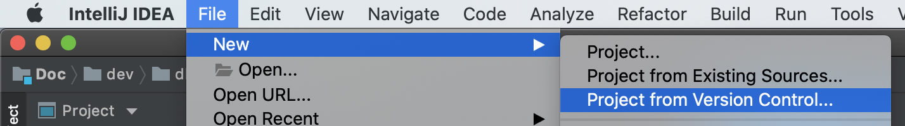

- 프로젝트를 open 해 주세요.
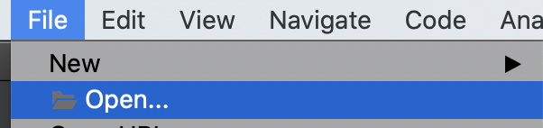

### 2. 내 이름의 Branch 생성하기
- 프로젝트가 open 이 되었고 우측 하단에 `현재 브랜치`가 `Master` 임을 확인 할 수 있습니다.  

- `Git:master` 버튼을 누르면 `로컬(local)`과 `원격(remote)` 프로젝트에 존재하는 모든 브랜치를 확인할 수 있습니다.     
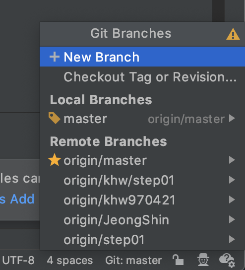

- `Remote Branches > origin/master > New Branch from Selected...` 를 선택하고 `github id `이름의 새로운 branch 를 생성합니다.         
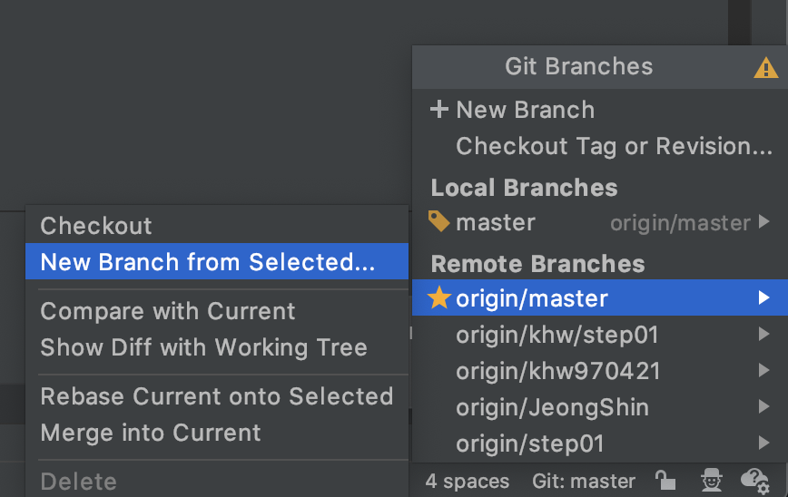

- 브랜치를 생성하고 checkout 을 했으므로 현재 브랜치가 `eyabc` 로 변경되었습니다.  

- `local` 에 eyabc 라는 새로운 Branch 가 생성되었음을 확인할 수 있습니다. 
아직 `remote` 에는 eyabc branch 가 없습니다. 
로컬에 생성된 eyabc 의 브랜치를, github 저장소에 있는 레파지토리(remote) 에 반영을 해야 합니다.
기억 하시나요? 일전에 master 에서 branch 를 생성할 때 local branch 가 아닌 remote branch 에서 branch 를 생성했었습니다.
따라서 eyabc 에서 'step01' 의 브랜치를 만들려면. 일단 remote branch 에 eyabc branch 가 있어야 합니다.   

- 다음은 local 의 eyabc 브랜치를 remote 에 반영할 차례 입니다. 
- push 를 통하여 remote 브랜치에 반영할 수 있습니다.    

- push 를 하고 나면 remote branch 에 eyabc 라는 브랜치가 생성 됐음을 확인할 수 있습니다.
github 저장소에서도 확인할 수 있어요.

### 3. step01 브랜치 생성
우리는 같은 저장소(CatSearch)를 공유 합니다. 이럴 경우. 실수로 다른 사람의 branch 를 침범하거나
원격 저장소에 나쁜짓을 하게 될 수가 있습니다. 그래서 Fork 라는 기능을 사용해 carSearch 를 복사(Fork) 
해서 작업하는 안전한 방법이 있는데요. 하지만 이번 프로젝트를 하면서 Fork 를 하지 않고 같은 저장소를 사용할 것입니다.
저장소를 사용을 하다가 문제점을 직접 느끼게 되면 Fork 를 하는 방식으로 개선해 봅시다.

- remote 의 eyabc 브랜치에서 새로운 branch step01 를 생성합니다.       

- 잘못된 예 1: branch 이름을 'step01' 이라고만 적으면,
eyabc 브랜치에서 step01 을 이미 만들면, JeongShing 브랜치에서 step01 을 만들 수 없게 됩니다.         

그렇기 때문에 브랜치의 이름을 step01 이라고 쓰지 않습니다.

step 01 의 브랜치를 삭제하는 방법은, local branch 에 Step01 브랜치가 생성될텐데, 
현재 브랜치를 step01 이 아닌 master 나 `이외의 브랜치로 checkout` 해준 다음에,
local 에 있는 `step01 브랜치 > delete` 해 줍니다.
현재의 브랜치를 삭제하려면, 다른 브랜치에서 checkout 한 후 지울 수 있습니다.
  
- 잘못된 예 2: `eyabc/step01` 
분기 b가 존재 하면 이름이 지정된 분기를 b/anything 작성할 수 없습니다.
 [:link:](https://stackoverflow.com/questions/22630404/git-push-refs-heads-my-subbranch-exists-cannot-create)        
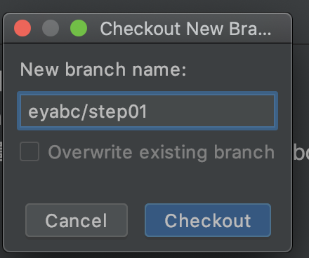

- 옳은 예: `_eyabc/step01` 자신의 이름에 `_` underbar 를 붙여줍니다.     

로컬에 성공적으로 branch 가 생성되었습니다.            
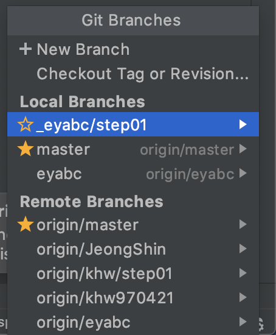

현재 브랜치는 _eyabc/step01 입니다.      

### 4. _name/step01 에서 코딩하기
- index.html 생성
- src 폴더 생성
- src/App.js
- src/main.js

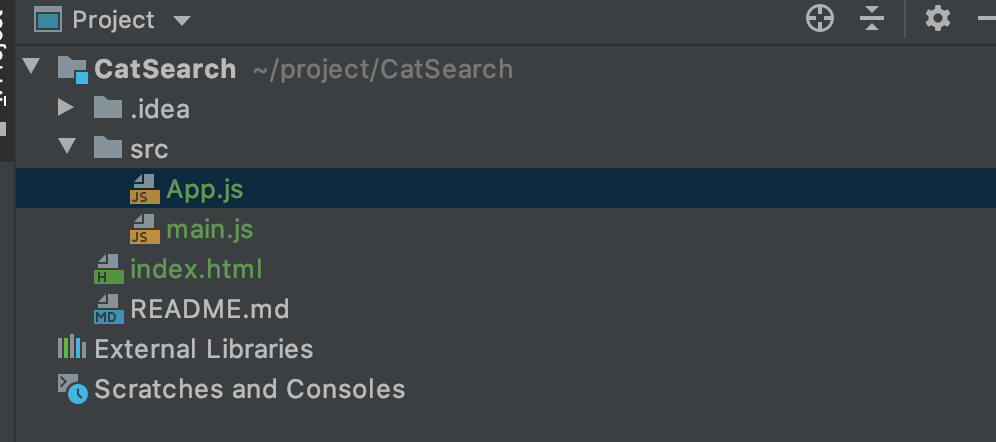

- 생성한 파일을 commit 합니다. 맥 기준으로 `command + k` 단축키를 이용할 수 있습니다.     
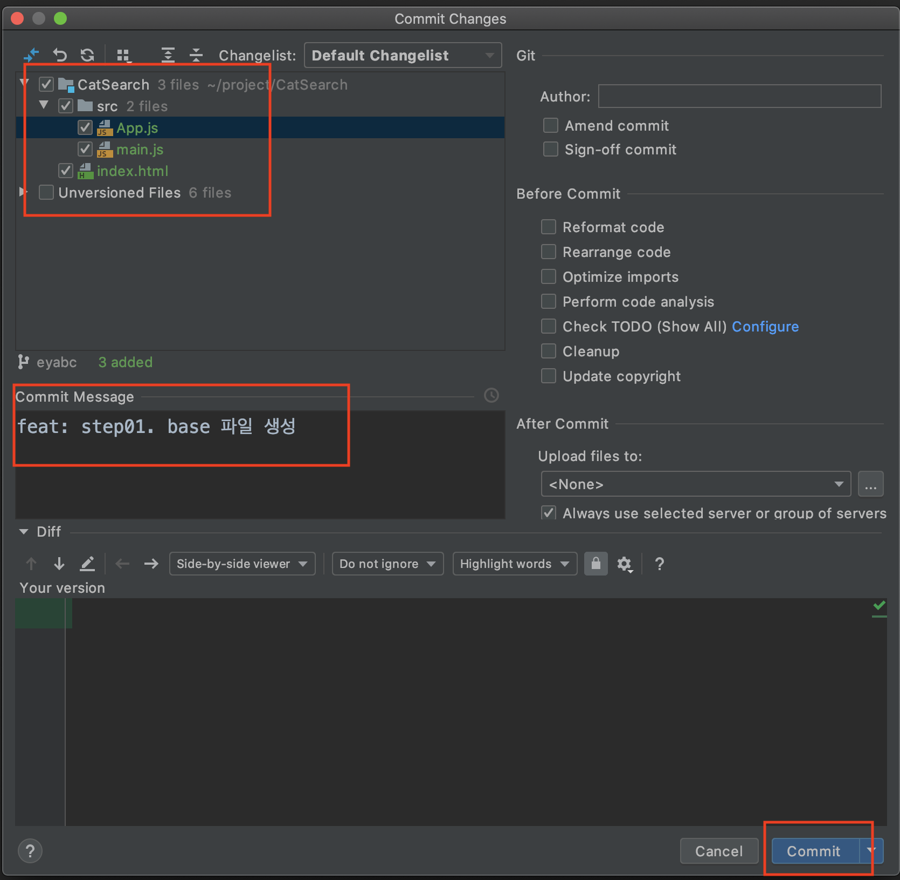
    1. 파일 목록을 꼼꼼히 확인
    1. 파일 목록의 내용을 꼼꼼히 확인
    1. 커밋 메세지 작성
    1. commit 버튼 클릭 
    
- 화살표를 클릭하면 commit 과 동시에 push 창을 띄어주는 것을 연속으로 할 수 있는 기능을 볼 수 있습니다.      
일단 화살표의 option 을 선택하지 않고 commit 버튼을 눌러 줍니다.     
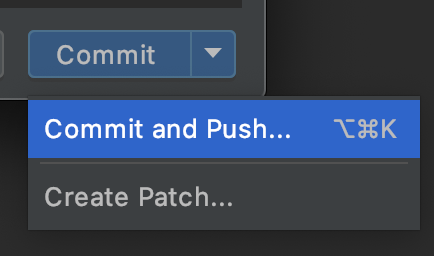

- push 기능은 우측 하단의 현재 브랜치 버튼을 누르면 이용할 수 있는데요.    
앗 이런, step01 에서 작업을 해야 하는데 eyabc 에서 작업을 하고 있었습니다.

- 인텔리제이의 terminal 을 열어 명령어 `$ git reset --soft HEAD^` 를 입력해줍니다. [:link:](https://eyabc.github.io/TIL/development/Tools/Git/git.html#%EB%A7%88%EC%A7%80%EB%A7%89-%EC%BB%A4%EB%B0%8B-%EC%B7%A8%EC%86%8C%ED%95%98%EA%B8%B0)
이 명령어는 마지막 커밋을 취소하고 작업 디렉토리와 인덱스를 보존해 파일이 스테이지된 상태를 유지하도록 합니다.  
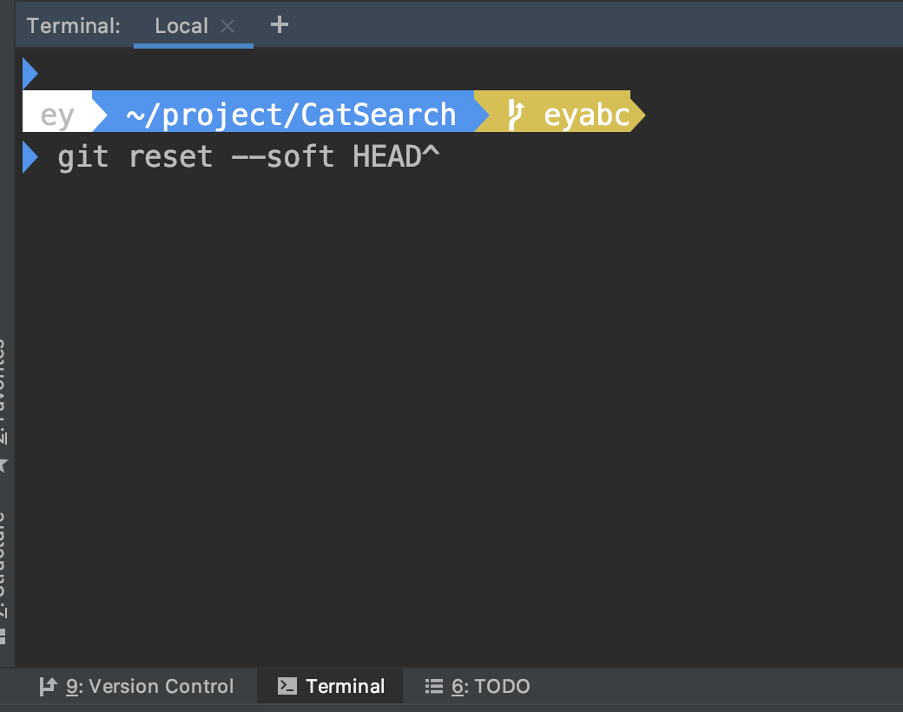

- commit 이 취소 되어 파일들이 초록색으로 되었습니다.  
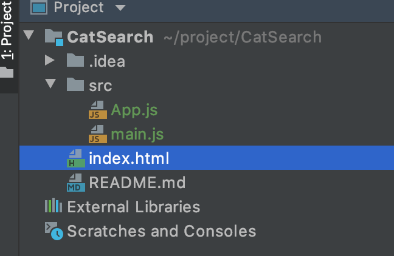

- 이제 _eyabc/step01 브랜치로 체크아웃 합니다. eyabc 에서 commit 되지 않은 파일들은 
step01 브랜치로 체크아웃 되면서 step01 에서 작업한 파일들처럼 이용할 수 있습니다.    

- _eyabc/step01 에서 파일들을 commit 합니다.
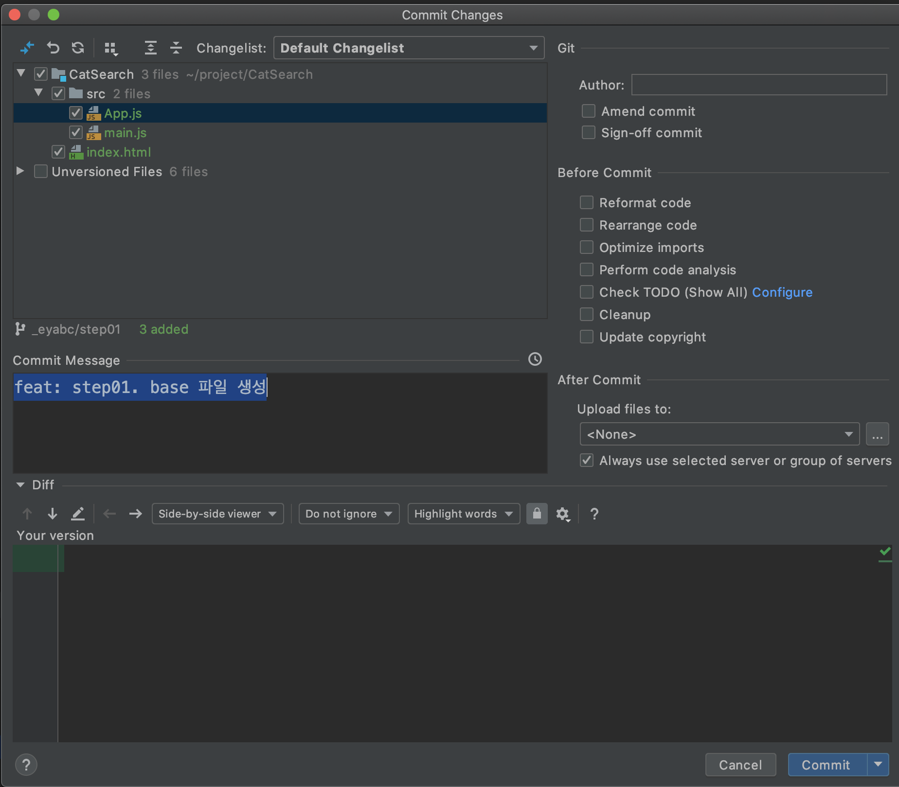

a. `commit and push` 를 이용하거나

b. 현재 브랜치 메뉴에서 push 를 할 수 있습니다.
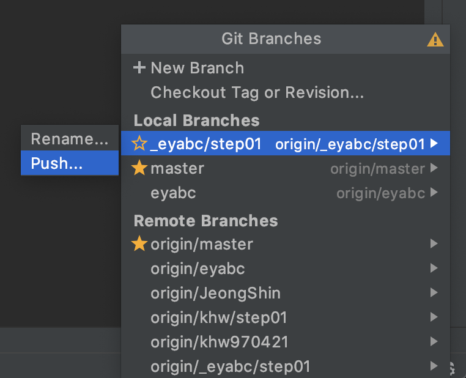

- `commit and push` 혹은 현재 브랜치 메뉴에서 `push` 버튼을 누르면 아래의 push 창이 뜹니다. 

    1. `_eyabc/step01 -> origin: _eyabc/step01 (new)`
        - 화살표의 왼쪽은 로컬에서의 branch
        - 화살표의 오른쪽은 원격에서의 branch 를 의미합니다.
        - 원격에는 아직 _eyabc/step01 브랜치가 없기 때문에 new 라는 표시가 있습니다.
    1. commit 내역들을 다시한번 꼼꼼히 확인해 주세요.
    1. push 버튼을 누릅니다.
    
- 원격 Branch 에 _eyabc/step01 이 생성된 것을 확인할 수 있습니다.

### 5. PR 작성하기
- github 의 catSearch 레파지토리의 Pull Request 탭에 들어옵니다. `compare and pull request` 를 누릅니다.

- PR 를 작성합니다.
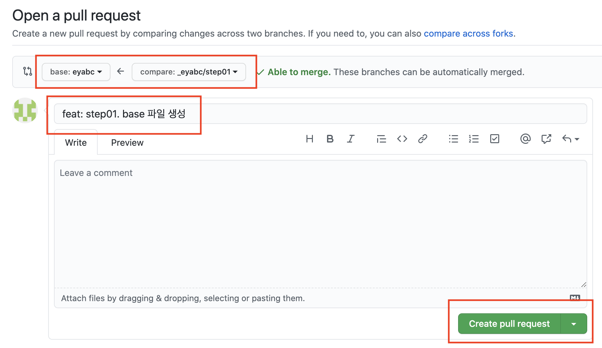
    1. PR 의 방향은 `eyabc(이름) <= step01` 을 향하도록 합니다.
    1. PR `제목`을 작성합니다.
    1. `assignees` 에 `eyabc` 를 등록합니다.
    1. `Create pull Request` 를 누릅니다. 

- PR 의 요청이 완료 되었고. assignee 가 PR 를 리뷰하고 피드백 하는 과정을 마친 후에 제가 Merge 를 해줍니다.       
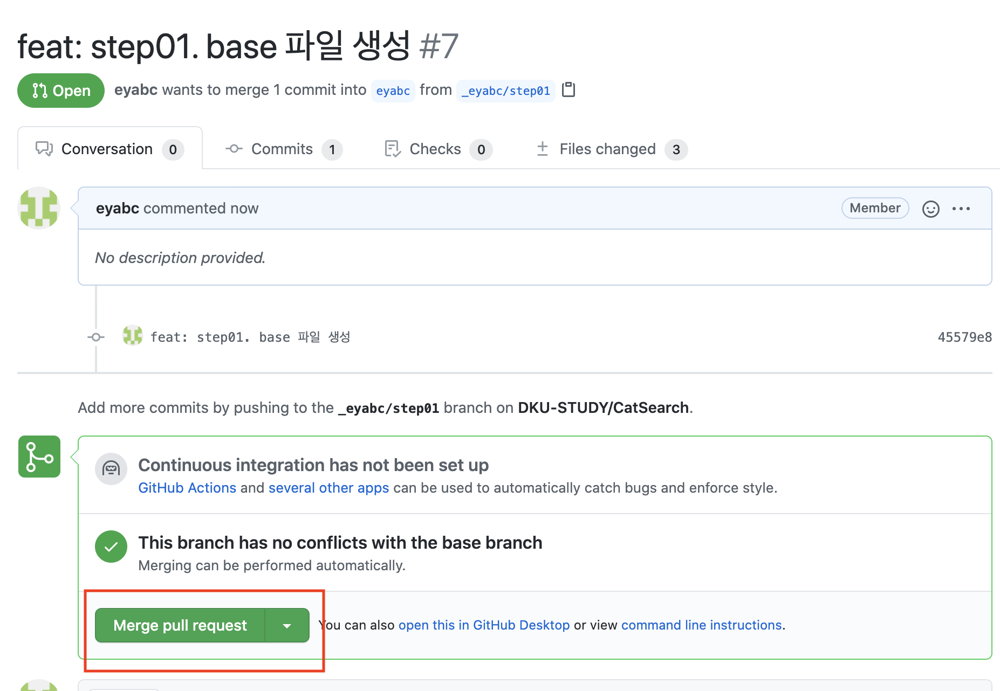

- merge 된 PR    

- step01 의 내용이 eyabc 브랜치에 성공적으로 merge 된 것을 확인할 수 있습니다.
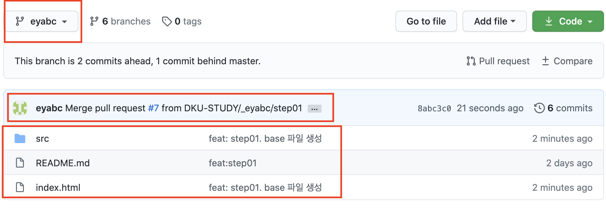
